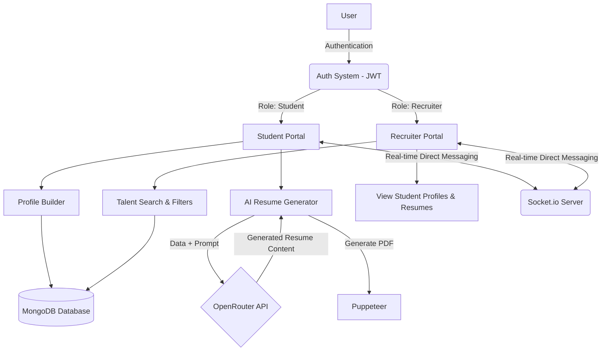

# The Academic Curator 🎓

The Academic Curator is a comprehensive platform bridging the gap between students and recruiters. It empowers students to build professional profiles, generate AI-powered resumes, and connect with potential employers. For recruiters, it offers powerful tools to discover, evaluate, and communicate with top academic talent.

## 🚀 Features

### For Students
- **Profile Building**: Create detailed profiles showcasing skills, education, projects, and certifications.
- **AI Resume Generator**: Automatically generate professional, formatted resumes utilizing AI (OpenRouter).
- **Recruiter Connections**: Discover and connect with verified recruiters.
- **Real-Time Chat**: Direct, instant communication with recruiters.

### For Recruiters
- **Talent Discovery**: Advanced search and filtering to find suitable students.
- **Student Evaluation**: View comprehensive student profiles, portfolios, and AI-generated resumes.
- **Connection Management**: Connect with students and manage potential candidates.
- **Real-Time Communication**: Integrated messaging system to contact students.

## 🔄 System Workflow



## 🛠️ Technology Stack

### Frontend
- **Framework**: React.js with Vite
- **Styling**: Tailwind CSS
- **Routing**: React Router DOM
- **Icons**: Lucide React
- **Real-Time**: Socket.io Client
- **API Requests**: Axios

### Backend
- **Runtime**: Node.js
- **Framework**: Express.js
- **Database**: MongoDB (Mongoose ORM)
- **Authentication**: JWT (JSON Web Tokens) & BcryptJS
- **Real-Time**: Socket.io
- **AI Integration**: OpenRouter API
- **PDF Generation**: Puppeteer

## 📁 Project Structure

```text
The-Academic-Curator/
├── backend/                # Node.js Express server
│   ├── models/             # Mongoose schemas (User, StudentProfile, Recruiter, Message, etc.)
│   ├── routes/             # Express API routes
│   ├── middleware/         # Auth and validation middlewares
│   └── server.js           # Server entry point
├── frontend/               # React Vite frontend application
│   ├── src/
│   │   ├── components/     # Reusable React components
│   │   ├── context/        # Application state (e.g., Auth)
│   │   ├── pages/          # Full page views (Student & Recruiter portals)
│   │   └── assets/         # Static images, styles, and assets
│   └── package.json        # Frontend dependencies
├── landingPage.html        # Concept static landing page
└── chat.html               # Concept static chat interface
```

## 📄 Core Files & Features

### Backend Files
- **`server.js`**: Main entry point for the backend, initializing Express, connecting to MongoDB, setting up Socket.io for real-time chat, and registering API routes.
- **`routes/aiRoutes.js`**: Handles integration with the OpenRouter AI API to process and format student information for resume generation.
- **`routes/authRoutes.js`**: Manages secure user authentication, registration, login, and token generation using JWT.
- **`routes/studentRoutes.js`**: Contains endpoints for students to create, read, update, and manage their detailed academic and professional profiles.
- **`routes/resumeRoutes.js`**: Responsible for creating, formatting, and serving PDF resumes generated from student profiles.
- **`routes/messageRoutes.js` & `connectionRoutes.js`**: Handlers for creating recruiter-student connections and processing real-time direct messages.
- **`models/*.js`**: Mongoose database schemas defining the structure for `User`, `StudentProfile`, `Recruiter`, `Connection`, and `Message` documents.

### Frontend Files
- **`src/pages/LandingPage.jsx`**: The primary marketing and entry page showcasing platform capabilities and directing users to relevant portals.
- **`src/pages/student/ProfileBuilder.jsx`**: A comprehensive, multi-step form for students to input their education, skills, experiences, and projects.
- **`src/pages/student/ResumeGenerator.jsx`**: Interface where students can preview and generate their AI-powered professional resumes.
- **`src/pages/recruiter/Search.jsx`**: Advanced search and filtering interface for recruiters to discover matching student talent.
- **`src/pages/Chat.jsx`**: A dynamic, real-time messaging interface powered by WebSockets allowing direct communication between recruiters and students.
- **`src/pages/recruiter/StudentProfileDetail.jsx`**: Detailed view for recruiters to assess a candidate's full portfolio and resume.

## ⚙️ Installation & Setup

### Prerequisites
- [Node.js](https://nodejs.org/) (v16+ recommended)
- [MongoDB](https://www.mongodb.com/) (Local or MongoDB Atlas)
- API keys for AI functionalities (OpenRouter API)

### 1. Clone the repository
```bash
git clone https://github.com/nikhilhanumantu/The-Academic-Curator.git
cd The-Academic-Curator
```

### 2. Backend Setup
```bash
cd backend
npm install
```

Create a `.env` file in the `backend` directory and add the necessary environment variables:
```env
PORT=5000
MONGO_URI=your_mongodb_connection_string
JWT_SECRET=your_jwt_secret_key
OPENROUTER_API_KEY=your_openrouter_api_key
```

Start the backend development server:
```bash
npm run dev
# Expected Output: Server running on port 5000 / MongoDB connected
```

### 3. Frontend Setup
Open a new terminal window:
```bash
cd frontend
npm install
```

Start the Vite development server:
```bash
npm run dev
# Expected Output: Frontend running on http://localhost:5173
```

## 🔒 Environment Variables

| Variable | Location | Description |
|----------|----------|-------------|
| `PORT` | `backend/.env` | The port for the backend server (e.g., 5000) |
| `MONGO_URI` | `backend/.env` | Connection string for your MongoDB database |
| `JWT_SECRET` | `backend/.env` | Secret string for hashing/signing JSON Web Tokens |
| `OPENROUTER_API_KEY` | `backend/.env` | API key to enable AI-powered resume generation |


---
*Built to empower the academic and recruitment community.*
